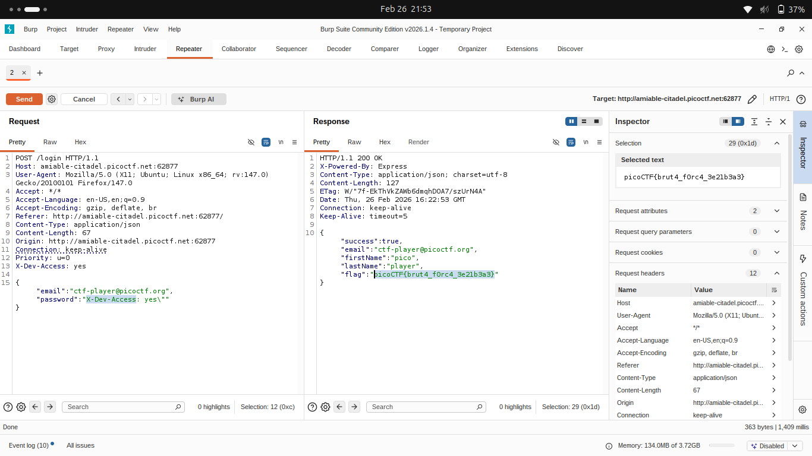

## process
use burpsuite to intercept request and add header that collected from inspect it is inform of `rot13`.

change request like this by given `email` as email and add `X-Dev-Access: yes` as header.

