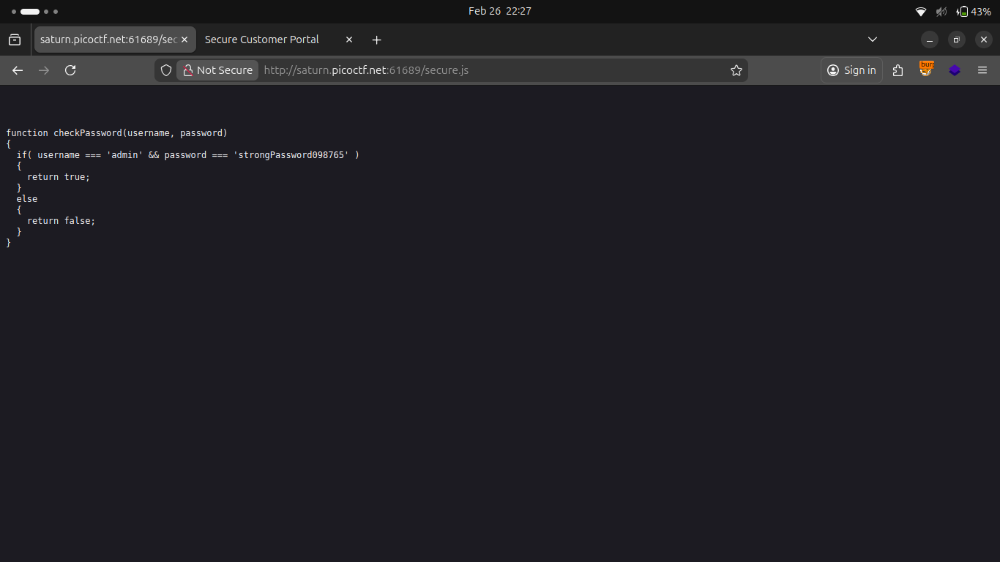

## process

I started intercepting the request change values done lots of stuff. everytime it ends on same result their i found it not validating password in server.

I checked the code. tried sqli not worked then examined properly then it checkes the password by calling a function i looked where the function not there.

Then i looked any file is included thier it is `secure.js` try to opened by url it opened it got username & password.

Entered details in from Got the Flag.
